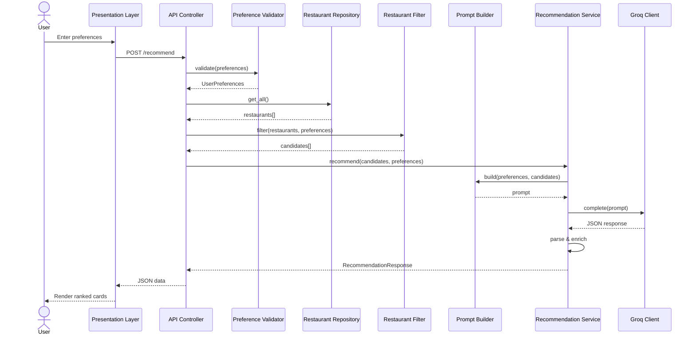

# Architecture: AI-Powered Restaurant Recommendation System

This document describes the technical architecture for the Zomato-inspired restaurant recommendation service defined in `context.md`. The system combines structured restaurant data from Hugging Face with Groq LLM inference to produce personalized, explainable recommendations.

---

## 1. Architecture Goals

| Goal | Description |
| :--- | :--- |
| **Separation of concerns** | Data loading, filtering, LLM reasoning, and presentation are isolated modules with clear interfaces. |
| **Deterministic pre-filtering** | Hard constraints (location, budget, rating) are applied before the LLM to reduce token cost and hallucination risk. |
| **Explainability** | Every recommendation includes an LLM-generated rationale tied to user preferences. |
| **Extensibility** | Swap UI frameworks or data sources without rewriting core logic; LLM access is isolated behind a Groq adapter. |
| **Testability** | Pure functions for filtering/ranking prep; mockable LLM adapter for unit tests. |

---

## 2. Component Architecture

### 2.1 Data Ingestion Layer
**Responsibility:** Load, normalize, and cache the Zomato dataset once at startup (or on first request).

| Component | Role |
| :--- | :--- |
| **DatasetLoader** | Fetches `ManikaSaini/zomato-restaurant-recommendation` via `datasets` (Hugging Face). |
| **DataPreprocessor** | Maps raw columns to a canonical schema, handles nulls, normalizes text fields. |
| **RestaurantRepository** | In-memory query interface over the preprocessed dataset. |

**Canonical Restaurant Schema:**
```python
Restaurant = {
    "id": str,              # stable identifier (index or dataset id)
    "name": str,
    "location": str,        # city / locality
    "cuisines": list[str],  # e.g. ["Italian", "Continental"]
    "cost_for_two": int,    # numeric cost indicator
    "rating": float,        # e.g. 4.2
    "votes": int,           # optional: popularity signal
    "rest_type": str,       # optional: casual dining, cafe, etc.
}
```

**Preprocessing steps:**
1. Download dataset split (typically train).
2. Select and rename relevant columns to the canonical schema.
3. Parse cuisine strings into lists (e.g. `"Italian, Chinese"` → `["Italian", "Chinese"]`).
4. Coerce rating and cost to numeric types; drop or impute invalid rows.
5. Normalize location strings (trim, title-case, alias map for city names).
6. Derive `budget_tier` from `cost_for_two` using configurable thresholds:

| Tier | Typical `cost_for_two` range (INR) |
| :--- | :--- |
| **low** | ≤ 500 |
| **medium** | 501 – 1500 |
| **high** | > 1500 |

*Caching strategy:* Load once into a pandas DataFrame or list of Restaurant objects. Persist a local parquet/CSV snapshot to avoid repeated Hugging Face downloads during development.

### 2.2 User Input Layer
**Responsibility:** Collect, validate, and normalize user preferences.

**Input model:**
```python
UserPreferences = {
    "location": str,           # required
    "budget": str,             # "low" | "medium" | "high"
    "cuisine": str | None,     # optional primary cuisine
    "min_rating": float,       # e.g. 3.5
    "additional": str | None,  # free-text: "family-friendly, quick service"
}
```

| Component | Role |
| :--- | :--- |
| **PreferenceForm** | UI form or CLI prompt collecting fields. |
| **PreferenceValidator** | Enforces required fields, enum values, rating bounds. |
| **PreferenceNormalizer** | Lowercases cuisine, maps city aliases, trims free text. |

### 2.3 Integration Layer
**Responsibility:** Apply hard filters, rank candidates heuristically, and assemble the LLM prompt.

#### 2.3.1 Restaurant Filter
Applies deterministic filters in sequence:
`all restaurants` → `location` → `budget tier` → `min_rating` → `cuisine` → `sort by rating/votes` → `take top N (15–20)`

| Component | Role |
| :--- | :--- |
| **RestaurantFilter** | Executes filter pipeline; returns `list[Restaurant]`. |
| **CandidateSelector** | Caps result count and applies tie-breaking. |

#### 2.3.2 Prompt Builder
Constructs a structured prompt containing System instructions, User preferences, Candidate restaurants (JSON), and the ranking Task.

### 2.4 Recommendation Engine (LLM Layer)
**Responsibility:** Invoke the LLM, handle retries, parse and validate the response, merge with structured data.

| Component | Role |
| :--- | :--- |
| **LLMClient** | Thin adapter over the Groq API via the official `groq` Python SDK. |
| **RecommendationService**| Orchestrates prompt → LLM → parse → enrich. |
| **ResponseParser** | Parses JSON; validates schema; handles malformed output. |
| **RecommendationEnricher**| Joins LLM ranks/explanations with full restaurant records. |

**Groq Integration Details:**
- **SDK:** `groq` (Official Python client)
- **Model:** `llama-3.3-70b-versatile` (Strong reasoning) or `llama-3.1-8b-instant` (Fallback).
- **Temperature:** `0.3` (for consistent JSON).

### 2.5 Output Display Layer
**Responsibility:** Render recommendations in a clear, scannable format.

| Component | Role |
| :--- | :--- |
| **RecommendationPresenter**| Formats `RecommendationResponse` for UI or CLI. |
| **ResultsView** | Cards/table showing name, cuisine, rating, cost, explanation. |
| **SummaryBanner** | Optional LLM summary at the top. |

---

## 3. Request Flow (Sequence Diagram)



---

## 4. Proposed Module Structure
Recommended layout for a Python implementation:

```text
zomato-milestone1/
├── docs/
├── src/
│   ├── main.py                    # entry point (CLI or app bootstrap)
│   ├── config.py                  # env vars, budget thresholds, top-K
│   ├── models/                    # Data classes
│   ├── data/                      # HF loader, preprocessor, repository
│   ├── services/                  # Filter, prompt builder, Groq LLM client
│   ├── api/                       # FastAPI routes & schemas
│   └── ui/                        # Streamlit app / CLI
├── tests/
├── data/                          # cached parquet/csv (gitignored)
├── .env.example                   
└── requirements.txt
```

---

## 5. Technology Stack (Recommended)
| Layer | Technology | Rationale |
| :--- | :--- | :--- |
| **Language** | Python 3.11+ | Strong ecosystem for data + LLM integration. |
| **Dataset** | `datasets` (HF) | Direct access to the specified dataset. |
| **Data processing**| `pandas` | Filtering, normalization, caching. |
| **LLM** | Groq API | Fast, low-latency inference. |
| **LLM SDK** | `groq` | Official Groq Python client. |
| **API** | `FastAPI` | Lightweight async REST for frontend decoupling. |
| **UI** | Streamlit / Gradio | Rapid prototyping of preference form + results. |
| **Config** | `pydantic-settings` | Typed config and secret management. |
| **Testing** | `pytest` | Unit tests for filter, parser, preprocessor. |
