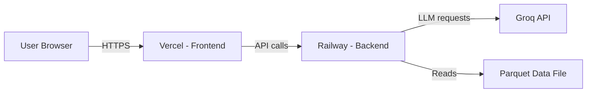

# 🚀 BtrBite Deployment Plan

> **Backend → Railway** | **Frontend → Vercel**

---

## Architecture Overview



| Component | Platform | URL Pattern |
|-----------|----------|-------------|
| Frontend (React + Vite) | **Vercel** | `https://btrbite.vercel.app` |
| Backend (FastAPI + Uvicorn) | **Railway** | `https://btrbite-api.up.railway.app` |

---

## Pre-Deployment Checklist

- [x] `.gitignore` protects `.env` and `data/*.parquet`
- [x] `.env.example` documents required env vars
- [x] Code pushed to GitHub: `Vivekacreates1309/BtrBite_Zomato_Milestone`

---

## Part 1: Backend Deployment on Railway

### Step 1 — Code Changes Required

Three files need updates before deploying:

#### 1.1 Create `Procfile` (project root)

Railway needs this to know how to start the app:

```
web: uvicorn src.api.main:app --host 0.0.0.0 --port $PORT
```

#### 1.2 Create `runtime.txt` (project root)

Specify the Python version:

```
python-3.11.9
```

#### 1.3 Update CORS in `src/api/main.py`

The current CORS config only allows `localhost`. Update it to accept the Vercel frontend domain:

```python
import os

# CORS — allow both local dev and production Vercel domain
allowed_origins = [
    "http://localhost:5173",
    "http://127.0.0.1:5173",
]

# Add production frontend URL from environment variable
frontend_url = os.getenv("FRONTEND_URL", "")
if frontend_url:
    allowed_origins.append(frontend_url)

app.add_middleware(
    CORSMiddleware,
    allow_origins=allowed_origins,
    allow_credentials=True,
    allow_methods=["*"],
    allow_headers=["*"],
)
```

#### 1.4 Update `requirements.txt`

Pin versions for reproducible deploys:

```
pandas==2.2.3
datasets==3.6.0
pydantic==2.11.7
pydantic-settings==2.9.1
pyarrow==19.0.1
fastapi==0.115.12
uvicorn[standard]==0.34.3
groq==0.25.0
```

> [!NOTE]
> Remove `streamlit` and `pytest` — they are not needed in the production backend.

### Step 2 — Handle the Data File (Important!)

The `data/zomato_cleaned.parquet` file is **~145 MB** and is gitignored. Railway deploys from Git, so it won't have this file. Two options:

#### Option A: Git LFS (Recommended)

Track the parquet file with Git Large File Storage:

```bash
# Install Git LFS (one-time)
git lfs install

# Track parquet files
git lfs track "data/*.parquet"

# Add the tracking config and data file
git add .gitattributes
git add data/zomato_cleaned.parquet
git commit -m "chore: add parquet data via Git LFS"
git push
```

> [!IMPORTANT]
> You'll need to **remove** `data/*.parquet` from `.gitignore` before adding it to LFS.

#### Option B: Download at Startup

Modify `src/data/repository.py` to download the parquet file from a URL (e.g., Google Drive, HuggingFace, or a GCS bucket) if it doesn't exist locally. This avoids large files in Git entirely.

### Step 3 — Deploy on Railway

1. Go to [railway.app](https://railway.app) and sign in with GitHub.

2. Click **"New Project"** → **"Deploy from GitHub Repo"**.

3. Select the repo: `Vivekacreates1309/BtrBite_Zomato_Milestone`.

4. Railway will auto-detect Python. Confirm it uses the `Procfile`.

5. **Set environment variables** in Railway dashboard → Variables tab:

   | Variable | Value |
   |----------|-------|
   | `GROQ_API_KEY` | `gsk_k8puQzvu6...` (your actual key) |
   | `GROQ_MODEL` | `llama-3.3-70b-versatile` |
   | `GROQ_TEMPERATURE` | `0.3` |
   | `FRONTEND_URL` | `https://btrbite.vercel.app` *(set after Vercel deploy)* |
   | `PORT` | *(auto-set by Railway — do NOT set manually)* |

6. Click **Deploy**. Railway will:
   - Install dependencies from `requirements.txt`
   - Run the `Procfile` command
   - Assign a public URL like `https://btrbite-api.up.railway.app`

7. **Verify**: Visit `https://<your-railway-url>/health` — you should see:
   ```json
   {"status": "healthy", "restaurants_loaded": 51717}
   ```

---

## Part 2: Frontend Deployment on Vercel

### Step 1 — Code Changes Required

#### 1.1 Update `frontend/src/api/client.js`

Replace the hardcoded `/api/v1` base URL with an environment-aware version:

```javascript
const API_BASE = import.meta.env.VITE_API_URL
  ? `${import.meta.env.VITE_API_URL}/api/v1`
  : '/api/v1';
```

This uses:
- **Local dev**: Falls back to `/api/v1` (proxied by Vite to `localhost:8000`)
- **Production**: Uses the Railway backend URL from `VITE_API_URL`

#### 1.2 Create `frontend/vercel.json`

Handle client-side routing and security headers:

```json
{
  "buildCommand": "npm run build",
  "outputDirectory": "dist",
  "framework": "vite",
  "rewrites": [
    { "source": "/(.*)", "destination": "/index.html" }
  ],
  "headers": [
    {
      "source": "/(.*)",
      "headers": [
        { "key": "X-Content-Type-Options", "value": "nosniff" },
        { "key": "X-Frame-Options", "value": "DENY" }
      ]
    }
  ]
}
```

#### 1.3 Fix TypeScript Build

The `package.json` build script runs `tsc && vite build`, but the project uses `.jsx` files. Update `frontend/package.json`:

```json
"scripts": {
  "dev": "vite",
  "build": "vite build",
  "preview": "vite preview"
}
```

### Step 2 — Deploy on Vercel

1. Go to [vercel.com](https://vercel.com) and sign in with GitHub.

2. Click **"Add New Project"** → Import `Vivekacreates1309/BtrBite_Zomato_Milestone`.

3. **Configure the project:**

   | Setting | Value |
   |---------|-------|
   | **Root Directory** | `frontend` |
   | **Framework Preset** | Vite |
   | **Build Command** | `npm run build` *(auto-detected)* |
   | **Output Directory** | `dist` *(auto-detected)* |

4. **Set environment variables** in Vercel dashboard:

   | Variable | Value |
   |----------|-------|
   | `VITE_API_URL` | `https://<your-railway-url>` *(from Railway step 6)* |

   > [!WARNING]
   > Vite only exposes env vars prefixed with `VITE_` to the client bundle. The prefix is required.

5. Click **Deploy**.

6. **Verify**: Open your Vercel URL — the app should load, and searching for restaurants should return results from the Railway backend.

---

## Part 3: Post-Deployment Wiring

After both platforms are deployed, you need to connect them:

### 3.1 Update Railway's `FRONTEND_URL`

1. Copy your Vercel deployment URL (e.g., `https://btrbite.vercel.app`)
2. In Railway dashboard → Variables, set:
   ```
   FRONTEND_URL = https://btrbite.vercel.app
   ```
3. Railway will auto-redeploy.

### 3.2 Verify End-to-End

| Check | How |
|-------|-----|
| Backend health | Visit `https://<railway-url>/health` |
| Frontend loads | Visit `https://<vercel-url>` |
| API connectivity | Search for a location and click "Find My Bite" |
| CORS working | No errors in browser console (F12 → Console) |

---

## Summary of All File Changes

| File | Action | Purpose |
|------|--------|---------|
| `Procfile` | **CREATE** | Railway start command |
| `runtime.txt` | **CREATE** | Python version for Railway |
| `requirements.txt` | **MODIFY** | Pin versions, remove dev deps |
| `src/api/main.py` | **MODIFY** | Dynamic CORS from env var |
| `frontend/src/api/client.js` | **MODIFY** | Dynamic API URL from env var |
| `frontend/vercel.json` | **CREATE** | Vercel config + SPA routing |
| `frontend/package.json` | **MODIFY** | Remove `tsc` from build |
| `.gitignore` | **MODIFY** | Remove `data/*.parquet` if using LFS |

---

## Estimated Costs

| Platform | Plan | Cost |
|----------|------|------|
| **Railway** | Trial / Hobby | Free $5 credit → then ~$5/month |
| **Vercel** | Hobby | Free |
| **Groq API** | Free tier | Free (rate-limited) |

---

## Troubleshooting

| Issue | Cause | Fix |
|-------|-------|-----|
| CORS errors in browser | `FRONTEND_URL` not set on Railway | Add the Vercel URL to Railway env vars |
| "Failed to fetch locations" | `VITE_API_URL` not set on Vercel | Add the Railway URL to Vercel env vars |
| Railway deploy fails | Missing parquet data file | Use Git LFS or download-at-startup approach |
| Build fails on Vercel | `tsc` command not found | Remove `tsc &&` from build script |
| 500 errors on recommend | Missing `GROQ_API_KEY` on Railway | Add the API key to Railway env vars |
